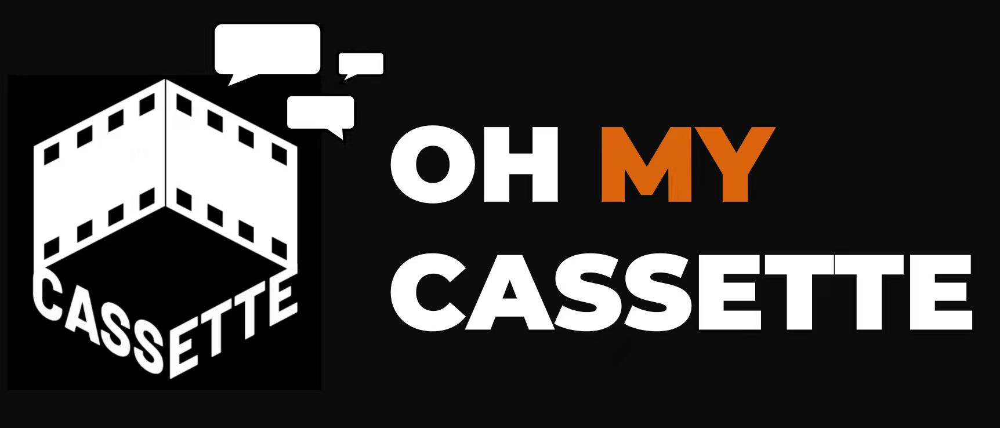

<p align="center">
  
</p>

<h1 align="center">
Oh My <a href="https://trycassette.online/">Cassette</a>: 随身 AI 剪辑搭档
</h1>

<p align="center">
  <a href="https://github.com/Cassette-Editor/oh-my-cassette/releases">
    
  </a>
  <a href="https://github.com/Cassette-Editor/oh-my-cassette/blob/main/LICENSE">
    
  </a>
  <a href="https://github.com/Cassette-Editor/oh-my-cassette/stargazers">
    
  </a>
  <a href="https://github.com/Cassette-Editor/oh-my-cassette/fork">
    
  </a>
  
  <a href="https://github.com/Cassette-Editor/oh-my-cassette/actions/workflows/ci.yml">
    
  </a>
  <a href="https://trycassette.online">
    
  </a>
  <a href="https://github.com/nousresearch/hermes-agent">
    
  </a>
</p>

<p align="center">
  <b>简体中文</b> | <a href="./README.md">English</a>
</p>

<table align="center" width="82%">
<tr>
<td>
  <video src="https://github.com/user-attachments/assets/efcfda75-f09b-4bde-8a69-e84410f28e10" controls width="100%"></video>
</td>
</tr>
</table>

<h3 align="center">
  <em>
  让你的 <a href="https://github.com/nousresearch/hermes-agent">Hermes</a> 拥有 <a href="https://trycassette.online">Cassette</a> 强大的视频剪辑能力。<br />
  加个好友，聊聊就出片。
  </em>
</h3>

# 🎥 项目概览

**Oh My Cassette** 是一个面向 <a href="https://trycassette.online">Cassette</a> 视频剪辑工作流的 harness plugin 和视频剪辑 skill，专为 Agent 协作与调度设计，并尽可能减少token消耗。

你随时可以在手机上发送视频或音频素材，并和 Agent 聊聊你的想法，Agent 就会与 Cassette 协作，理解你的创作意图，整理素材，规划剪辑流程，并通过强大的剪辑能力，帮你制作可以直接分享的成片。

无需手动拉时间线，不用学剪辑，聊聊想法，**Oh My Cassette** 帮你记录灵感、直接成片。

<table>
  <tr>
    <td align="center" width="33%">
      <h3>📱 随时记录</h3>
      <p>看到什么、想到什么，随时把素材和想法发给你的 AI 剪辑师。</p>
    </td>
    <td align="center" width="33%">
      <h3>💬 聊天剪辑</h3>
      <p>不用拉时间线，不用学复杂工具，用自然语言说出你想要的视频。</p>
    </td>
    <td align="center" width="33%">
      <h3>🎵 智能配乐</h3>
      <p>根据素材氛围、视频节奏和故事情绪，音乐匹配到你心巴上。</p>
    </td>
    </tr>
    <tr>
    <td align="center" width="33%">
      <h3>🌌 蒙太奇成片</h3>
      <p>自动整理素材、编排故事，生成有节奏、有情绪、有记忆点的视频。</p>
    </td>
    <td align="center" width="33%">
      <h3>✨ 高级剪辑能力</h3>
      <p>支持标题字幕、画中画、音乐卡点、硬切转场、动效和风格化处理。</p>
    </td>
    <td align="center" width="33%">
      <h3>✅ 分享即用</h3>
      <p>支持预览、修改和导出，从零散片段快速变成可以发布的成片。</p>
    </td>
  </tr>
</table>

## 🎬 案例视频

<table width="100%">
<tr>
<td width="33%" valign="top">
  <video src="https://github.com/user-attachments/assets/ff19c37d-1eb4-4702-a2e1-eac704bdbae8" controls width="100%"></video>
  <h3>日常碎片Vlog</h3>
  <p>
    <sub>🎞️ 输入：15 段视频 · 1 段音频</sub><br />
    <sub>⏱️ 处理时间：10 分钟</sub>
  </p>
  <p><b>提示词</b><br />
  根据我提供的音频素材进行卡点剪辑，从全部视频素材中挑选最合适的画面，与歌词内容和节奏匹配。每次歌词切换都更换不同镜头，画面要有旅行感、生活感和情绪递进，并在每个对应画面中间添加歌词字幕，整体卡点。</p>
  <p><code>治愈</code> <code>日常</code> <code>轻松</code> <code>生活方式</code></p>
</td>
<td width="33%" valign="top">
  <video src="https://github.com/user-attachments/assets/b85285a9-30ed-4f9b-b314-538bfd9dbdd6" controls width="100%"></video>
  <h3>旅行Vlog</h3>
  <p>
    <sub>🎞️ 输入：13 段视频 · 1 段音频</sub><br />
    <sub>⏱️ 处理时间：15 分钟</sub>
  </p>
  <p><b>提示词</b><br />
  帮我剪一个30秒的旅行vlog，使用全部素材，符合观看逻辑，开场和结尾需要添加标题字幕“KOTA KINABALU“。加入Vlog拍摄时间，人物视频叠加在相似风景镜头上做画中画效果，节奏轻快，有记忆点，转场以硬切和音乐卡点为主，清爽，有度假感</p>
  <p><code>旅行</code> <code>旅拍</code> <code>节奏卡点</code> <code>画中画</code></p>
</td>
<td width="33%" valign="top">
  <video src="https://github.com/user-attachments/assets/73059786-246e-4808-b7cf-4deb35994ebc" controls width="100%"></video>
  <h3>电影情绪短片</h3>
  <p>
    <sub>🎞️ 输入：15 段视频 · 1 段音频</sub><br />
    <sub>⏱️ 处理时间：17 分钟</sub>
  </p>
  <p><b>提示词</b><br />
  用我的素材剪一个40秒左右的歌词向情绪短片。空镜开场建立氛围，中段穿插人物独处、回忆和情绪特写，人物画面与空镜穿插使用，配合歌词字幕卡点推进，字幕单词采用不同大小分布排列，最后使用安静的停顿镜头收尾。</p>
  <p><code>音乐</code> <code>音乐视频</code> <code>电影感</code></p>
</td>
</tr>
<tr>
<td width="33%" valign="top">
  <video src="https://github.com/user-attachments/assets/97fdfe3a-f420-4135-8c62-494bbb7ea436" controls width="100%"></video>
  <h3>美食教程</h3>
  <p>
    <sub>🎞️ 输入：12 段视频 · 1 段音频</sub><br />
    <sub>⏱️ 处理时间：8 分钟</sub>
  </p>
  <p><b>提示词</b><br />
  帮我用这些素材剪一个青椒炒肉的做饭视频，按步骤剪顺一点，保留炒菜声音，加简单字幕说明。字幕可以根据画面内容自由发挥，用来帮助观众理解步骤，风格简洁自然，不遮挡食材。</p>
  <p><code>美食</code> <code>教程</code> <code>解说</code></p>
</td>
<td width="33%" valign="top">
  <video src="https://github.com/user-attachments/assets/8da38e40-7876-4743-a32d-5fd95265f37e" controls width="100%"></video>
  <h3>广告</h3>
  <p>
    <sub>🎞️ 输入：15 段视频 · 15 个音效 · 1 段音频</sub><br />
    <sub>⏱️ 处理时间：13 分钟</sub>
  </p>
  <p><b>提示词</b><br />
  帮我用这些素材剪一个15秒产品广告，开头开瓶盖，中间加一些气泡、水花、冰块和产品细节，最后展示完整产品和品牌，整体要清爽解渴、有广告感。</p>
  <p><code>产品</code> <code>短片</code> <code>商业广告</code></p>
</td>
<td width="33%" valign="top">
  <video src="https://github.com/user-attachments/assets/9374de93-c0ff-4bf2-b1ed-fe393579f0c2" controls width="100%"></video>
  <h3>游戏高光视频</h3>
  <p>
    <sub>🎞️ 输入：5 段视频 · 1 段音频</sub><br />
    <sub>⏱️ 处理时间：5 分钟</sub>
  </p>
  <p><b>提示词</b><br />
  用我的游戏素材剪一个 20–30 秒的武侠战斗短片，整体质感为水墨风，气氛肃杀。做出孤身入局、杀出重围的电影感。</p>
  <p><code>游戏</code> <code>高光</code> <code>节奏卡点</code></p>
</td>
</tr>
</table>

<p align="center">
  <strong>★ 更多案例持续更新中，欢迎 Star 关注本项目。</strong>
</p>

# 🏄 无需安装试用

我们提供了一个公开网页演示入口，你可以直接在电脑或手机浏览器里体验 Oh My Cassette 的消息式剪辑流程，不需要先在本地安装 Hermes Agent：

<a href="http://43.134.224.156:8080/"> 立即试用 </a>

> [!WARNING]
> 该公开演示仅用于功能展示和评估。当前入口刻意不做登录鉴权，请不要上传任何敏感、私密、保密、违法、受版权限制、受监管或不适合公开处理的内容。
>
> 你上传的素材、提示词、生成结果、任务状态、排障信息，以及 BGM 流程中涉及的音乐搜索信息，可能会被该演示服务器、Cassette、DeepSeek 以及相关第三方音乐/搜索服务处理。请把上传到公开演示的任何内容都视为演示维护者和工作流相关外部服务可见。
>
> 该演示可能随时重置、限流、不可用或变更。我们不承诺数据保留或删除时效，不承诺保密性、生产可用性、输出质量、版权合规性或服务连续性。你需要自行确认上传内容的权利状态，并在分享任何生成结果前自行审核。
>
> 浏览器刷新、关闭标签页或离开 Web Demo 页面时，会开启新的网页会话，并尽力清理上一个网页会话的临时上传、聊天历史和已结束任务文件。这个清理策略只属于演示网页服务。
>
> 默认情况下，演示会使用服务器侧配置的 DeepSeek API Key（如果可用）。你也可以在网页右上角 **设置** 中填写自己的 DeepSeek API Key 进行测试。该 key 只会随请求发送到当前演示服务器，Web 应用不会把它写入仓库或服务端磁盘；但它仍会经过公开演示服务器，请使用可以随时轮换和监控的 key。

<details>
<summary>本地部署 Web Demo</summary>

Web Demo 是一个单进程 FastAPI 服务：它保留 Oh My Cassette 现有 gateway 流程，只把用户入口换成浏览器网页。上传素材、任务状态、导出文件、截图和网页 outbox 等运行时数据会写入 `CASSETTE_ASSET_ROOT`，不会写入仓库。

1. 克隆仓库并创建独立的网页演示环境：

```bash
git clone https://github.com/Cassette-Editor/oh-my-cassette.git
cd oh-my-cassette

python3 -m venv .venv-web
. .venv-web/bin/activate
pip install -U pip
pip install -r requirements-web.txt
python -m playwright install chromium
```

2. 通过进程环境变量配置 Cassette 和 DeepSeek。Web Demo 不要求安装 Hermes Agent，也不要求存在 `~/.hermes/.env`：

```bash
cp deploy/oh-my-cassette-web.env.example ./oh-my-cassette-web.env
$EDITOR ./oh-my-cassette-web.env
```

至少需要设置：

```dotenv
CASSETTE_URL=https://sg.trycassette.online/agent
CASSETTE_AUTH_EMAIL=you@example.com
CASSETTE_AUTH_PASSWORD='your-cassette-password'
CASSETTE_ASSET_ROOT=$HOME/.oh-my-cassette/cassette
CASSETTE_BROWSER_TIMEOUT_SEC=1800

DEEPSEEK_API_KEY='your_deepseek_api_key'
DEEPSEEK_BASE_URL=https://api.deepseek.com
DEEPSEEK_MODEL=deepseek-v4-flash
OMC_WEB_HOST=0.0.0.0
OMC_WEB_PORT=8080
OMC_WEB_LOG_DIR=./web_demo/logs
```

如果用 `. ./oh-my-cassette-web.env` 加载配置，包含 shell 特殊字符、空格或 `#` 的值请加引号；systemd 的 `EnvironmentFile` 同样支持带引号的值。
Cassette 上传/分析等待默认继承 `CASSETTE_BROWSER_TIMEOUT_SEC`。只有需要单独设置上传超时时才配置 `CASSETTE_UPLOAD_TIMEOUT_SEC`；设为 `0` 表示无限等待。

启动前加载这些变量：

```bash
set -a
. ./oh-my-cassette-web.env
set +a
```

如果不希望在服务器上保存 DeepSeek API Key，可以把 `DEEPSEEK_API_KEY` 留空，然后在网页 **设置** 面板里临时填写自己的 key。浏览器提供的 key 只会附加在当前会话的请求上，Web 应用不会持久化保存。

Web Demo 服务日志和 Hermes Agent / OhMyCassette 插件日志是分开的。默认写入服务工作目录下的 `./web_demo/logs/web_demo.log`；如果设置了 `OMC_WEB_LOG_DIR`，则写入 `$OMC_WEB_LOG_DIR/web_demo.log`。
如果按上面的方式设置了 `CASSETTE_ASSET_ROOT`，Web Demo 的 Cassette job 记录也会和 Hermes 分开：原始 job JSON 位于 `$CASSETTE_ASSET_ROOT/jobs/cassette_*.json`，网页任务卡片会为当前浏览器会话拥有的任务提供 **日志** 链接。

3. 构建浏览器前端（Vite + React → `web_demo/frontend/dist`），仅在构建时需要 Node.js + npm：

```bash
./web_demo/build_frontend.sh
```

4. 启动网页演示：

```bash
. .venv-web/bin/activate
python -m web_demo.server
```

> 服务端只提供构建产物 `web_demo/frontend/dist`。如果尚未构建，访问 `/` 会返回明确的 503 并提示先执行构建。拉取 `web_demo/frontend` 下的改动后，请重新运行 `web_demo/build_frontend.sh`。

本机测试打开 `http://127.0.0.1:8080/`；如果要让手机或其他电脑访问，请打开 `http://<服务器 IP>:8080/`，并确认服务器防火墙或云安全组允许入站 TCP `8080`。

4. 可选：使用 systemd 常驻运行：

```bash
sudo cp deploy/oh-my-cassette-web.service.example /etc/systemd/system/oh-my-cassette-web.service
sudo cp deploy/oh-my-cassette-web.env.example /etc/oh-my-cassette-web.env
sudo $EDITOR /etc/oh-my-cassette-web.env
sudo systemctl daemon-reload
sudo systemctl enable --now oh-my-cassette-web
sudo systemctl status oh-my-cassette-web
journalctl -u oh-my-cassette-web -f
```

启用前请检查 `/etc/systemd/system/oh-my-cassette-web.service`，如果你的仓库路径或虚拟环境路径与示例不同，需要先改成自己的实际路径。
`journalctl` 用来看 uvicorn 标准输出和 access log；Web Demo 业务日志仍写到 `$OMC_WEB_LOG_DIR/web_demo.log`。

5. 简单验收：

```bash
curl -fsS http://127.0.0.1:8080/ -o /dev/null
python3 -m compileall -q web_demo tools.py notifier.py browser.py
tail -f ./web_demo/logs/web_demo.log
```

然后在浏览器中上传一个小的视频文件，发送剪辑指令，观察事件流和任务卡片，直到出现导出下载入口。
</details>

# 🚀 快速开始

## 开始之前 🎬

本插件基于 <a href="https://trycassette.online/agent"> Cassette Agent </a> 页面构建，并兼容 Hermes Agent。你需要：

* 一个可正常运行的 Hermes Agent。
* 一个 Cassette 账号。
* 一个已经配置好的 Hermes 网关，例如 QQ 或 Telegram。

> [!TIP]
> **在这里申请 Cassette 账号：**[**Cassette 注册**](https://trycassette.online/signup/)

如果还没有安装 Hermes Agent：

```bash
curl -fsSL https://raw.githubusercontent.com/NousResearch/hermes-agent/main/scripts/install.sh | bash
```

如果还没有配置 Hermes Agent 网关：

```bash
hermes gateway setup
```

Oh My Cassette 目前支持 QQ 和 Telegram 网关。

## 环境要求

- 已安装 Hermes Agent，并已通过 Hermes 完成网关配置。
- Python 3.11–3.13（与 Hermes Agent 支持范围一致；最近一次验证基于 hermes-agent 0.15.2）。
- `ffmpeg`，仅用于在上传前将网关收到的视频标准化为 H.264 MP4。

安装系统工具：

```bash
# macOS
brew install uv ffmpeg
```

```bash
# Debian/Ubuntu Linux
sudo apt-get update
sudo apt-get install -y ffmpeg
curl -LsSf https://astral.sh/uv/install.sh | sh
```

## 安装

通过 Hermes 插件管理器安装（推荐）：

```bash
hermes plugins install Cassette-Editor/oh-my-cassette
```

Hermes 安装器会提示输入你的 Cassette 账号邮箱和密码，并保存到 `~/.hermes/.env`。随后运行完成设置命令——它会在 Hermes Python 环境中安装 Playwright Chromium、检测 `ffmpeg`/`ffprobe` 路径，并让你选择 Cassette 地区——然后启用插件：

```bash
python3 ~/.hermes/plugins/cassette/scripts/install_plugin.py --setup-only
hermes plugins enable cassette
hermes gateway restart
```

安装后也可以随时参考“诊断”一节检查状态。

<details>
<summary>备选方案：从 git 检出目录运行引导式安装器（适合开发）</summary>

```bash
git clone https://github.com/Cassette-Editor/oh-my-cassette.git
cd oh-my-cassette
python3 scripts/install_plugin.py
```

运行安装器，并按照提示设置插件和你的 Cassette 账号。

安装器会：

- 默认以符号链接方式把插件安装到 `~/.hermes/plugins/cassette`；
- 询问是否通过 `hermes plugins enable cassette` 启用插件；
- 询问使用哪个 Cassette 地址：
  - `https://sg.trycassette.online/agent`（亚洲，默认）
  - `https://trycassette.online/agent`（美洲）
- 可选地把 Cassette 登录信息和 Jamendo 凭据保存到 `~/.hermes/.env`；
- 检测服务环境中的 `ffmpeg` 和 `ffprobe` 路径；
- 在 Hermes Python 环境中安装 Python Playwright 和 Chromium；
- 重启 Hermes 网关服务。

如果希望复制文件而不是创建符号链接：

```bash
python3 scripts/install_plugin.py --copy --force
```

如果需要非交互式安装：

```bash
python3 scripts/install_plugin.py \
  --skip-plugin-enable \
  --skip-cassette-url \
  --skip-cassette-auth \
  --skip-jamendo-auth
```
</details>

## 开始使用 📼 

**现在可以拿起手机给你的 Agent 发私信了。记得保持 Agent 在线，并确保网络可用。**

在 QQ 或 Telegram 中：

1. 发送一个或多个视频、图片或音频文件。
2. 等待素材已保存的确认消息。
3. 在同一个会话中发送剪辑指令，也可以在指令前加 `/edit`。
4. 每个 Hermes 会话第一次剪辑时，选择 Cassette 模型和思考等级。
5. 每个 Hermes 会话第一次剪辑时，选择是否让 Hermes 优化剪辑需求，以及是否智能匹配背景音乐。
6. 插件会把保存的素材上传到 Cassette，驱动聊天面板，监控进度，导出 MP4，并在网关支持时把最终状态或媒体发回会话。

| 命令 | 说明 |
|---|---|
| `/new` 或 `/reset` | 清空素材，并和 Hermes 开始一个新会话。 |
| `/edit <剪辑指令>` | 按照你的指令剪辑当前视频。 |
| `/refine <剪辑指令>` | 优化你的剪辑指令，并开始剪辑。 |
| `/music <背景音乐需求>` | 按照你的需求为素材匹配并添加背景音乐。 |
| `/cut` | 停止当前 Cassette 剪辑任务。 |
| `/check_assets` | 查看已上传素材及其状态。 |
| `/cassette_model` | 选择当前 Cassette 模型和思考等级。 |
| `/cassette language zh` | 将 Cassette 的回复语言设置为中文。 |
| `/cassette language en` | 将 Cassette 的回复语言设置为英文。 |
| `/cassette status <job_id>` | 查看指定任务的状态。 |
| `/cassette cancel <job_id>` | 取消指定任务。 |

* 同一会话中的素材和视频状态会被保留。你可以继续发送消息，对剪辑结果做进一步修改。

* 使用 `/new` 或 `/reset` 可以开始一个新的 Hermes 会话，并清空该会话中的 Cassette 浏览器状态和素材。

* 默认情况下，QQ 使用中文，Telegram 使用英文。你也可以通过 `/cassette language zh/en` 手动切换语言。

## 更新

如果是通过 Hermes 插件管理器安装的：

```bash
hermes plugins update cassette
hermes gateway restart
```

如果是从 git 检出目录安装的（符号链接方式），更新检出目录：

```bash
git pull --ff-only
hermes gateway restart
```

如果安装插件时使用了 `--copy`，拉取更新后需要重新复制安装：

```bash
git pull --ff-only
python3 scripts/install_plugin.py --copy --force
hermes gateway restart
```

每个版本的变更记录见 [CHANGELOG.md](./CHANGELOG.md)。

<details>
<summary>把符号链接安装迁移到 Hermes 插件管理器（可选）</summary>

已有的符号链接安装会一直可用——迁移完全是可选的。若要切换：

```bash
rm ~/.hermes/plugins/cassette        # 只删除符号链接，不影响你的检出目录
hermes plugins install Cassette-Editor/oh-my-cassette
hermes gateway restart
```

`~/.hermes/.env` 中的凭据和插件的启用状态都会保留；已设置的值不会被再次询问。不要在符号链接上直接运行
`hermes plugins install --force`——它会报一个令人困惑的错误，而不是替换链接。
</details>

# 🔨 开发与排障

> [!TIP]
> 加入我们的Discord社区和`oh-my-cassette` 用户一起交流
>
> [](https://discord.gg/qd9NY4k8d7)

## 常见问答

### 1. 为什么 Hermes Agent 在 QQ 或 Telegram 中没有响应？

请检查 Hermes Agent 的模型配置、网络连接和 API 连通性。你也可以重启网关：

```bash
hermes gateway stop
hermes gateway restart
```

### 2. 为什么连接 Cassette 时出现网络问题？

请检查是否可以访问 https://sg.trycassette.online/agent 或 https://trycassette.online/agent 。如果无法访问，请检查网络设置，确保可以打开 Cassette。

### 3. 为什么运行速度比较慢？

剪辑过程取决于 Hermes Agent 的 API 延迟和 Cassette 服务负载。根据任务复杂度、所选模型和思考等级不同，一次剪辑任务大约需要 5-20 分钟。

如果 Hermes 或 Cassette 卡住，可以先发送 `/cut` 停止当前 Cassette 剪辑，再发送 `/stop` 停止 Hermes。之后可以在同一个会话中重试。

## 诊断

运行：

```bash
python3 scripts/diagnose_install.py
```

诊断项包括：

- 插件安装路径（符号链接安装和 `hermes plugins install` 的 git 克隆安装都能识别）；
- 插件是否已在 Hermes 中启用；
- `~/.hermes/.env` 中的配置值，并隐藏敏感信息；
- `ffmpeg` 和 `ffprobe`；
- Hermes Python 环境中的 Playwright；
- Cassette 地址是否可访问；
- 通过 Chromium 打开 Agent 页面检查 Cassette 登录凭据；
- Hermes 网关状态。

如果接收媒体时报错 `transcoder_missing`，请重新运行安装器，让它记录明确的 `CASSETTE_FFMPEG_BIN` 和 `CASSETTE_FFPROBE_BIN` 路径：

```bash
python3 scripts/install_plugin.py \
  --skip-plugin-enable \
  --skip-cassette-url \
  --skip-cassette-auth \
  --skip-jamendo-auth \
  --skip-playwright-install
```

## 配置

安装器会把常规运行时设置写入 `~/.hermes/.env`。你也可以手动编辑该文件。

<details>
<summary>展开配置详情</summary>

最小可用配置示例：

```bash
CASSETTE_URL=https://sg.trycassette.online/agent
CASSETTE_AUTH_EMAIL=you@example.com
CASSETTE_AUTH_PASSWORD=your-generated-cassette-password
CASSETTE_ASSET_ROOT=$HOME/.hermes/cassette
CASSETTE_HEADLESS=true
CASSETTE_FORCE_H264=true
```

默认媒体来源目录：

```text
~/.hermes/qqbot
~/.hermes/telegram
~/.hermes/weixin
~/.hermes/cache
~/.hermes/tmp
```

如果你的网关把媒体保存在其他位置：

```bash
CASSETTE_ALLOWED_SOURCE_ROOTS="$HOME/.hermes/qqbot:$HOME/.hermes/telegram:$HOME/.hermes/cache:$HOME/.hermes/tmp:/path/to/media"
```

可选的 Jamendo 智能配乐配置：

```bash
JAMENDO_CLIENT_ID=your_client_id
JAMENDO_CLIENT_SECRET=your_client_secret
```

`JAMENDO_CLIENT_SECRET` 是为未来功能预留的字段。它不会被发送给 Jamendo，也不会写入任务元数据。
</details>

## 开发

<details>
<summary>展开开发详情</summary>

创建本地测试环境：

```bash
uv venv .venv
uv pip install --python .venv/bin/python pytest playwright
.venv/bin/python -m playwright install chromium
```

运行检查：

```bash
python3 -m compileall -q .
.venv/bin/python -m pytest -q
```

运行本地 Cassette 端到端测试工具：

```bash
.venv/bin/python scripts/e2e_local_cassette.py \
  --media tests/fixtures/sample.mp4 \
  --instruction "制作一个 10 秒以内、带字幕的短视频。"
```

运行网页演示服务：

```bash
uv venv .venv-web
uv pip install --python .venv-web/bin/python -r requirements-web.txt
.venv-web/bin/python -m playwright install chromium
# 构建浏览器前端（Vite/React -> web_demo/frontend/dist）；需要 Node.js + npm。
./web_demo/build_frontend.sh
set -a
. ./oh-my-cassette-web.env
set +a
.venv-web/bin/python -m web_demo.server
```

浏览器前端是位于 `web_demo/frontend` 的 Vite + React + TypeScript 应用；`web_demo/build_frontend.sh` 会将其编译到 `web_demo/frontend/dist`，由服务端在 `/static` 下提供。构建产物不会提交到仓库，因此每次部署都需要构建（拉取前端改动后也要重新构建）。如需实时调试前端，可运行 `cd web_demo/frontend && npm run dev`，Vite 会把 `/api` 代理到 `http://127.0.0.1:8088`，请同时运行 FastAPI 服务。

网页演示会从进程环境变量读取 `CASSETTE_*`、`DEEPSEEK_*` 和 `OMC_WEB_*`。浏览器内也可以在“设置”里临时填写 DeepSeek API Key；该 key 只随请求发送到当前服务器，不会写入仓库或服务端磁盘。示例 systemd 文件在 `deploy/oh-my-cassette-web.service.example`，环境变量模板在 `deploy/oh-my-cassette-web.env.example`。

真实网关端到端测试是可选项，默认会跳过：

```bash
RUN_CASSETTE_E2E=1 .venv/bin/python -m pytest -q -m e2e
```

## 公共仓库安全

请不要提交：

- `.env` 或 `.env.e2e`；
- 真实网关令牌、账号 ID、聊天 ID 或原始 `wxid`；
- Cassette 凭据；
- Jamendo 凭据；
- 下载的媒体、导出文件、任务状态、浏览器追踪记录或本地运行时缓存。

运行时状态应保存在 `~/.hermes/cassette` 下，而不是这个仓库中。
</details>

## 许可证

MIT。详见 [LICENSE](LICENSE)。
